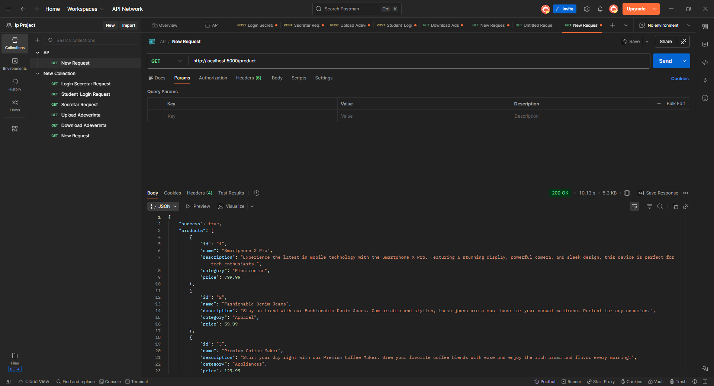
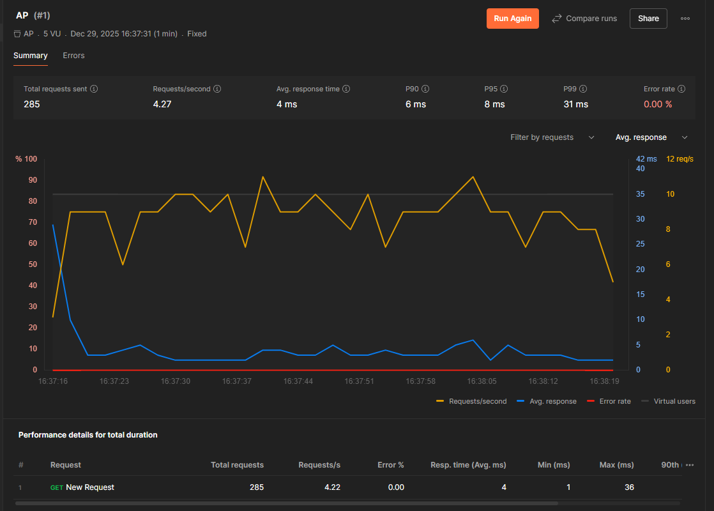

# Ex 1
CancellationToken inseamna ca programul se opreste in momentul cand acel token este activat(.Cancel())
Daca decomentam linia 32 atunci actiunea de cancel se paote face mai devereme. Adica in loc sa asteptam 2 cicluri de Thread.Sleep(), vom astepta maxim unul. Dupa primul Sleep se face iar verificare pe cancellationToken

# Ex 2
Threads = 1: Elapsed time: 722ms
Threads = 2: Elapsed time: 514ms
Threads = 4: Elapsed time: 235ms
Threads = 8: Elapsed time: 315ms


# Ex 3
=== Encrypting with 1 threads
Time: 398 ms

=== Encrypting with 2 threads
Time: 175 ms

=== Encrypting with 4 threads
Time: 150 ms

=== Encrypting with 8 threads
Time: 93 ms

# Ex 4
=== Decrypting with 1 threads
Decryption time: 923 ms
Decryption finished.

=== Decrypting with 2 threads
Decryption time: 477 ms
Decryption finished.

=== Decrypting with 4 threads
Decryption time: 385 ms
Decryption finished.

=== Decrypting with 8 threads
Decryption time: 234 ms
Decryption finished.

# Ex 5
Pentru a rula este nevoie de SixLabord.ImageSharp, .Fonts, .ImageSharp.Drawing
```
Sistem pornit. Apasa?i ENTER pentru a opri...
[Requester] URL primit: https://hips.hearstapps.com/hmg-prod/images/happy-dog-outdoors-royalty-free-image-1652927740.jpg
[Requester] Server ocupat (RETRY-LATER). Retry în 1s...
[Downloader] Salvat: happy-dog-outdoors-royalty-free-image-1652927740.jpg
[Requester] Server ocupat (RETRY-LATER). Retry în 2s...
[Processer] Watermark aplicat: happy-dog-outdoors-royalty-free-image-1652927740.watermarked.jpg
[Requester] Server ocupat (RETRY-LATER). Retry în 4s...
[Requester] Server ocupat (RETRY-LATER). Retry în 8s...
```


# Ex 6




